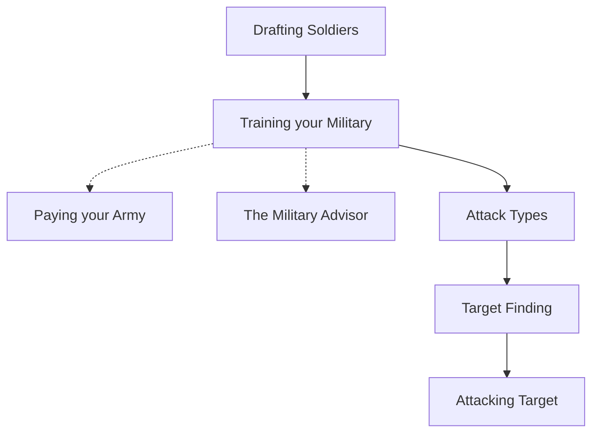

## How to Train Your Military

>[!tip] Drafting Soldiers
Rekrut prajurit dasar dengan menuju ke tab Militer dan memilih tingkat perekrutan dan target. Pastikan keseimbangan antara militer dan petani, karena mempertahankan pasukan besar bisa mahal. Prajurit dapat direkrut dengan kecepatan yang bervariasi, namun semakin cepat rekrutmen, semakin mahal biayanya per prajurit. Patriotisme dapat dilancarkan untuk meningkatkan efisiensi perekrutan.

>[!tip] Drafting Soldier
Setelah prajurit direkrut, latih mereka sebagai spesialis ofensif, defensif, elit, atau pencuri. Kekuatan dan biaya pelatihan setiap unit dapat bervariasi menurut ras, dan kekuatannya dinyatakan sebagai Off/Def. Pertimbangkan dengan hati-hati keseimbangan yang diinginkan antara mempertahankan provinsi dan menaklukkan musuh.

>[!note] Paying Your Army
Tetapkan tingkat upah 10% hingga 200% dari upah normal untuk membayar pasukan, karena upah diperlukan untuk memotivasi mereka menyerang. Memberikan upah yang lebih tinggi meningkatkan efisiensi militer, sedangkan memberikan upah yang lebih rendah akan menurunkannya. Tingkat upah dapat disesuaikan kapan saja.

>[!note] The Military Advisor
Penasihat Militer menyediakan informasi tentang pasukan di rumah, yang sedang dilatih, dan yang sedang dalam misi. Ini menyediakan empat laporan: Tingkat Upah, Kekuatan Militer, Ketersediaan Pasukan, dan Perkiraan Pelatihan Militer.

>[!tip] Attack Type
Dengan militer yang dibangun, komandan dapat diberikan perintah tentang bagaimana menempatkan pasukan. Ada beberapa jenis serangan yang dapat dilakukan, termasuk Tradisional March, Raze, Plunder, Learn, Massacre, Conquest, dan Ambush.

>[!tip] Target Finding
Untuk menemukan target, cari tanah yang lebih lemah, preman yang mungkin menyerang, dan peluang untuk mendapatkan sumber daya.

>[!tip] Attacking Target
Setelah kita menemukan target yang tepat untuk diserang, kita perlu mendapatkan intelijen yang memadai untuk memastikan bahwa serangan kita berhasil. Dengan melakukan spionase pada militer musuh, kita bisa mengetahui seberapa kuat pertahanan yang melindungi wilayah mereka. Namun, ada faktor acak kecil yang diterapkan pada semua serangan, sehingga kita perlu mengirim lebih banyak pasukan penyerang dari pertahanan musuh yang ada untuk memastikan bahwa serangan kita berhasil. Disarankan agar kita mengirim sekitar 104% dari pertahanan musuh kita. Namun, kita perlu berhati-hati - jika musuh melihat pencuri kita menyelinap di wilayah mereka, mereka mungkin mengambil tindakan sendiri untuk menghindari invasi kita.

